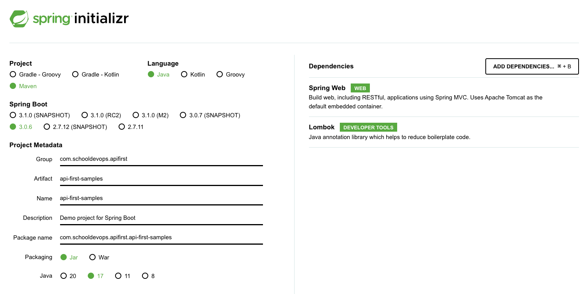
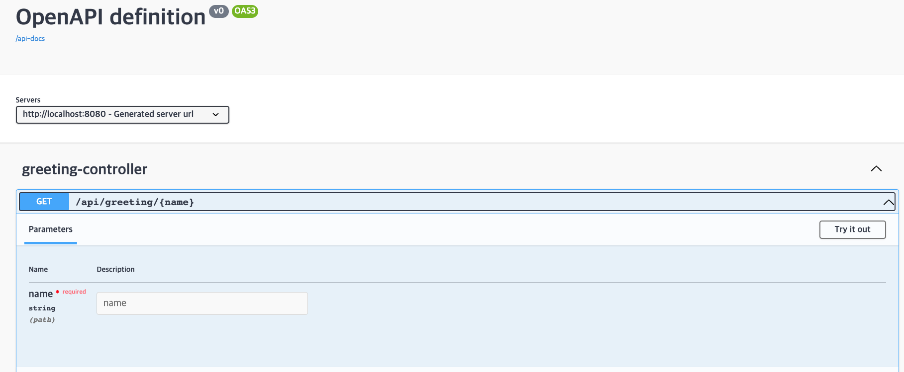
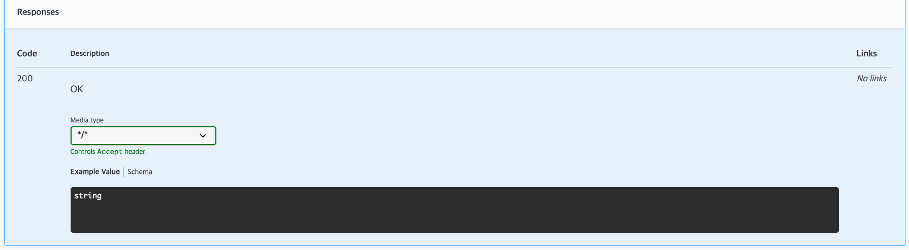
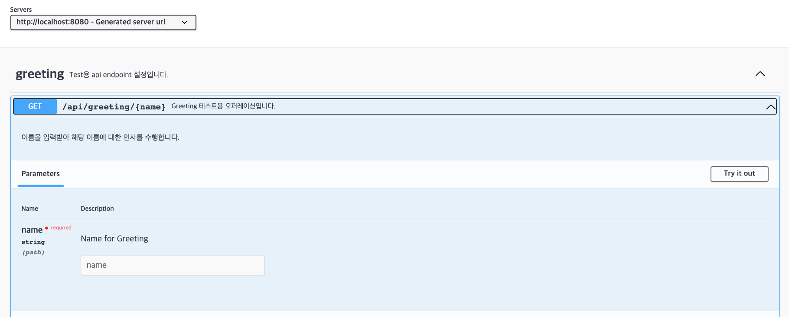
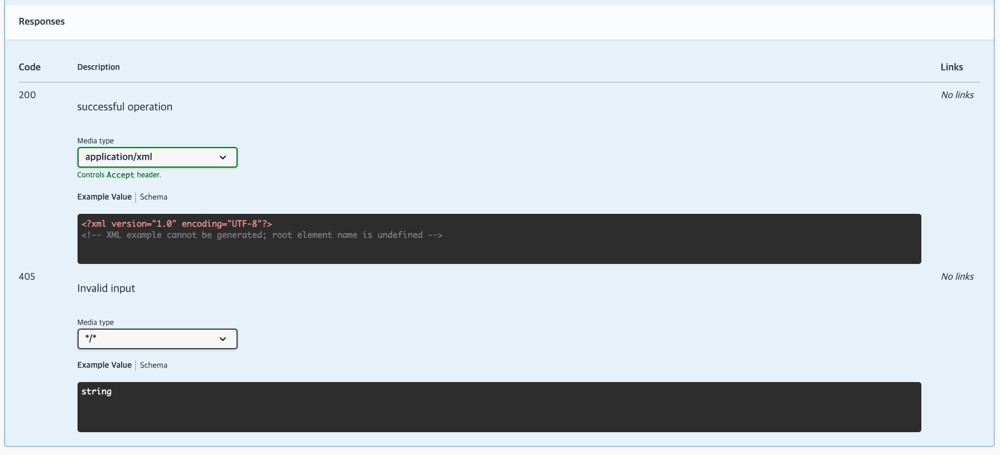

# Spring-docs 를 이용한 Swagger api 문서 자동생성

- 여기서 수행할 내용
  - spring-boot 를 이용하여 rest-api를 생성한다. 
  - spring-docs 를 이용하여 swagger api 문서 페이지를 생성한다. 

## 프로젝트 생성

- 프로젝트 생성을 위해서 ```https://start.spring.io/``` 에 접속하고 다음과 같이 프로젝트를 생성하자. 



- Project: Maven을 생성한다. 
- Language: Java
- SpringBoot: 3.0.6
- 프로젝트 메타정보
  - Group: 생성할 프로젝트의 패키지 이름을 설정한다. 
  - Artifact: 프로젝트 이름을 지정한다. 
- Java: 17
- Dependencies
  - Spring Web: REST-API를 위해 생성한다.
  - Lombok: 자동 getter/setter 등의 기능 지원

## 의존성 파일 주입

- pom.xml 파일에 다음과 같이 작성한다. 

```xml
<!-- springdoc-openapi -->
<dependency>
    <groupId>org.springdoc</groupId>
    <artifactId>springdoc-openapi-starter-webmvc-ui</artifactId>
    <version>2.1.0</version>
</dependency>
<!-- springdoc-openapi -->
```

- springdoc-openapi-starter-webmvc-ui 의존성을 추가하면 RestController에 자동으로 swagger 문서를 생성할 수 있도록 한다. 

## 설정파일 작성 

- application.properties 파일에 다음과 같이 api-doc 문서와 swagger-ui 를 생성한다. 

```properties
springdoc.api-docs.path=/api-docs
springdoc.swagger-ui.path=/swagger-ui.html
```

- springdoc 으로 api 문서를 조회할 수 있다. 
- swagger-ui 를 통해서 REST API 를 테스트해 볼 수 있다. 

## 소스코드 생성

- 이제 소스 코드를 생성하기 위해서 패키지를 하나 생성한다. 
- com.schooldevops.apifirst.apifistsamples 하윙 controller 패키지를 생성한다. 
- GreetingController.java 파일을 만들고 다음과 같은 코드를 추가하자. 

```java
package com.schooldevops.apifirst.apifirstsamples.controller;

import org.springframework.http.ResponseEntity;
import org.springframework.web.bind.annotation.GetMapping;
import org.springframework.web.bind.annotation.PathVariable;
import org.springframework.web.bind.annotation.RequestMapping;
import org.springframework.web.bind.annotation.RestController;

@RestController
@RequestMapping("/api")
public class GreetingController {

    @GetMapping("/greeting/{name}")
    public ResponseEntity<String> greeting(@PathVariable String name) {
        return ResponseEntity.ok(String.format("Hello %s.", name));
    }
}

```

- 위와 같이 @RestController 를 통해서 REST API를용 컨트롤러를 선언한다. 
- @RequestMapping("/api") 를 통해서 prefix 를 생성한다. 
- @GetMapping("/greeting/{name}") 
  - 이 매핑을 통해서 /api/greeting/<이름> 을 작성한다 
  - @PathVariable 어노테이션을 통해서 endpoint 끝에 이름값을 받아 들인다. 
- 그리고 결과적으로 ResonseEntity를 생성하고 결과를 반환한다.

## api-doc 조회하기

- springdocs 를 이용하면 api-doc 엔드포인트를 통해서 사용할 수 있는 REST api 목록을 확인할 수 있다. 
- ```curl http://localhost:8080/api-docs``` 을 조회한다. 

```json
{
   "openapi":"3.0.1",
   "info":{
      "title":"OpenAPI definition",
      "version":"v0"
   },
   "servers":[
      {
         "url":"http://localhost:8080",
         "description":"Generated server url"
      }
   ],
   "paths":{
      "/api/greeting/{name}":{
         "get":{
            "tags":[
               "greeting-controller"
            ],
            "operationId":"greeting",
            "parameters":[
               {
                  "name":"name",
                  "in":"path",
                  "required":true,
                  "schema":{
                     "type":"string"
                  }
               }
            ],
            "responses":{
               "200":{
                  "description":"OK",
                  "content":{
                     "*/*":{
                        "schema":{
                           "type":"string"
                        }
                     }
                  }
               }
            }
         }
      }
   },
   "components":{
      
   }
}
```

- 결과를 확인하면 rest api 에 대한 정의 문서를 볼 수 있다. 

### Swagger ui 생성하기. 

- 이제  Swagger UI를 이용하여 api-docs의 결과를 화면에 노출해주자. 
- ```http://localhost:8080/swagger-ui/index.html#/greeting-controller/greeting``` 을 통해서 swagger화면을 확인할 수 있다.





- swagger ui 화면을 통해서 요청을 테스트 해 볼 수 있다.

## Swagger Annotation 사용

- 이전 샘플에서 보았듯이 자동으로 REST endpoint에 대한 문서를 생성하고 있다. 
- 그러나 문서에 대한 설명과 파라미터 설정에 대한 좀더 구체적인 설명을 달기 위해서 Annotation을 사용할 수 있다. 

### @Tag

- @Tag는 api endpoint가 어떤 그룹에 속하는지 알려주는 그루핑 어노테이션이다. 

```java
@RestController
@RequestMapping("/api")
@Tag(name = "greeting", description = "Test용 api endpoint 설정입니다. ")
public class GreetingController {
  // ... 생략
}
```

### @Operation 

- @Operation 태그는 현재 REST API endpoint에 대한 아이디, 설명, 반환값 등을 지정하는 용도로 사용된다. 
- operationId: 엔드포인트의 아이디
- summary: 간단한 설명 swagger-ui 에 endpoint 상단에 노출된다. 
- description: 엔드포인트 상세 설명 
- tags: 현재 엔드포인트가 어떠한 tag 그룹에 속한지 알려준다. 
- response: 응답코드, 응답 타입 등을 지정한다. 
- security: 보안방법에 대한 설정을 지정한다. 

```java
    @Operation(
            operationId = "greeting",
            summary = "Greeting 테스트용 오퍼레이션입니다. ",
            description = "이름을 입력받아 해당 이름에 대한 인사를 수행합니다. ",
            tags = { "greeting" },
            responses = {
                    @ApiResponse(responseCode = "200", description = "successful operation", content = {
                            @Content(mediaType = "application/xml", schema = @Schema(implementation = String.class)),
                            @Content(mediaType = "application/json", schema = @Schema(implementation = String.class))
                    }),
                    @ApiResponse(responseCode = "405", description = "Invalid input")
            }
    )
    @GetMapping("/greeting/{name}")
    public ResponseEntity<String> greeting(
        ... 생략
    }
```

- 위 샘플과 같이 우리가 생성한 endpoint에 대한 상세 설명을 지정한다. 

### @Parameter

- @parameter 어노테이션은 입력되는 파라미터에 대한 타입과 설명을 지정한다. 
- name: 파리미터 이름
- description: 파리미터 설명
- required: 필수/선택 여부 (true이면 필수, false이면 선택이다.)
- in: 파리미터의 타입을 지정한다. 
  - ParameterIn.QUERY: 요청 쿼리 파라미터이다. ```&name=name_value``` 등과 같이 지정할 수 있다. 
  - ParameterIn.HEADER: 요청 헤더에 전달되는 파라미터이다. 
  - ParameterIn.PATH: PathVariable 에 속하는 파라미터이다. 
  - 값없음: RequestBody에 해당하는 객체 타입의 파라미터를 나타낸다. 

```java
    public ResponseEntity<String> greeting(
            @Parameter(name = "name", description = "Name for Greeting", required = true, in = ParameterIn.PATH) @PathVariable String name) {
        return ResponseEntity.ok(String.format("Hello %s.", name));
    }
```

### 적용 예제 





- 위와 같이 우리가 지정한 어노테이션 값이 출력된 것을 확인할 수 있다. 

## WrapUp

- REST API 를 생성하면, 외부에 공개되고, 이를 사용하는 사람에게 어떻게 사용하는지 사용 방법을 알려 줄 필요가 있다. 
- 이때 사용하는 다양한 도구가 있으며, 우리는 springdoc를 이용하여 api-doc 과 swagger-ui 를 적용해 보았다. 
- 매우 단순하게 필요한 api 문서가 생성되었으며, 실제 테스트도 수행해 볼수 있다는 것을 알게 되었다. 
- 또한 어노테이션을 통해서 REST API 문서에 대한 내역도 작성해 보았다. 
