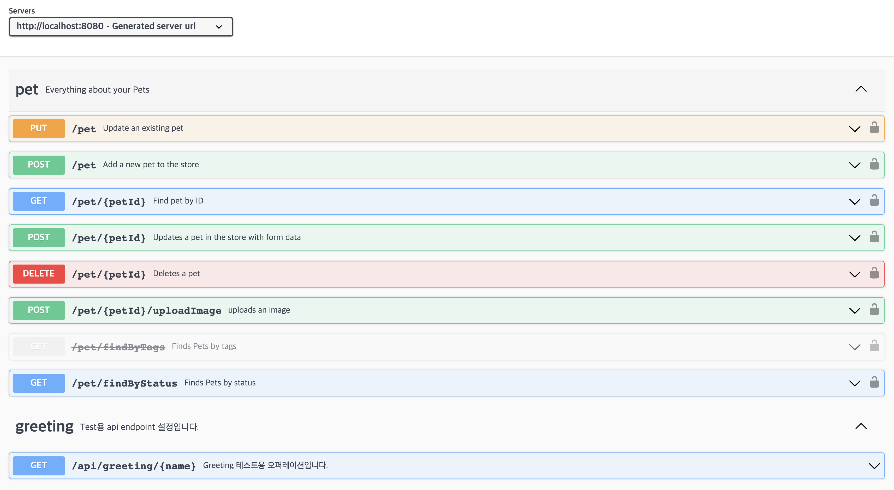
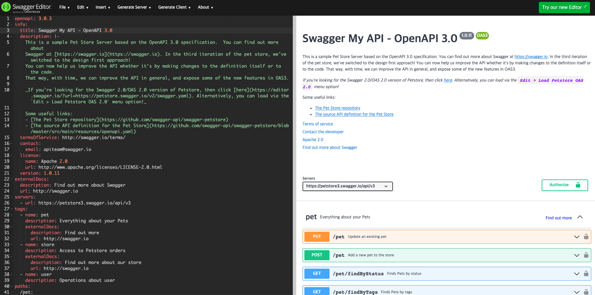

# Generating API with OpenAPI-Generator

- 이전 아티클에서는 openapi 를 이용하여 자동으로 api-doc을 자동생성하고, Swagger-UI로 생성된 내역을 확인해 보았다. 
- 이번에는 api를 우선 선언하고, 이를 이용하여 자동으로 REST API를 생성하고, 전달되는 Domain 객체를 자동으로 생성하는 방법을 알아볼 것이다. 
- 이번 아티클을 위해서는 [이전 샘플코드](https://github.com/schooldevops/schooldevops-api-first-developer-with-springboot/tree/main/api-first-skeleton-maven)를 우선 체크아웃 받아야 한다.

## 의존성 추가하기


- 사용할 의존성 객체
    - openapi-generator: openapi를 이용하여 기존 엔드포인트를 생성할 수 있는 라이브러리이다.
    - jackson-databind-nullable: REST API로 json 형식으로 전달될때 객체 변환을 위해 사용되는 라이브러리
    - validation-api: openapi에서 생성되는 코드가 참조할 검증을 위한 라이브러리
    - javax.annotation-api: openapi에서 생성되는 코드가 참조할 어노테이션 라이브러리
    - openapi-generator-maven-plugin: openapi 를 자동으로 생성할 플러그인 라이브러리
    - hibernate-validator: 검증용 의존성 객체 

<br/>

- pom.xml 을 열어 다음과 같이 코드를 추가하자.  

```xml

		<!-- springdoc-openapi 이전 샘플에서 추가된 라이브러리 -->
		<dependency>
			<groupId>org.springdoc</groupId>
			<artifactId>springdoc-openapi-starter-webmvc-ui</artifactId>
			<version>2.1.0</version>
		</dependency>
		<!-- springdoc-openapi -->

		<!-- openapi -->
		<dependency>
			<groupId>org.openapitools</groupId>
			<artifactId>openapi-generator</artifactId>
            <version>6.5.0</version>
		</dependency>
		<dependency>
			<groupId>org.openapitools</groupId>
			<artifactId>jackson-databind-nullable</artifactId>
			<version>0.2.6</version>
		</dependency>
		<dependency>
			<groupId>javax.validation</groupId>
			<artifactId>validation-api</artifactId>
			<version>2.0.1.Final</version>
		</dependency>
		<dependency>
			<groupId>javax.annotation</groupId>
			<artifactId>javax.annotation-api</artifactId>
			<version>1.3.2</version>
		</dependency>
		<dependency>
			<groupId>javax.servlet</groupId>
			<artifactId>javax.servlet-api</artifactId>
			<version>4.0.1</version>
			<scope>provided</scope>
		</dependency>
		<dependency>
			<groupId>org.openapitools</groupId>
			<artifactId>openapi-generator-maven-plugin</artifactId>
			<version>6.5.0</version>
		</dependency>
        <dependency>
          <groupId>org.hibernate.validator</groupId>
          <artifactId>hibernate-validator</artifactId>
          <version>8.0.0.Final</version>
        </dependency>

```

## Maven Plugin 등록하기. 

- 이제 Maven Plugin 을 등록해보자. 
- 플러그인은 openapi를 이용하여 skeleton/stub를 자동으로 생성하는 역할을 수행한다. 

<br/>

- pom.xml 파일에 다음과 같이 추가하자.

```xml
        <plugins>
			<plugin>
				<groupId>org.openapitools</groupId>
				<artifactId>openapi-generator-maven-plugin</artifactId>
				<version>6.5.0</version>
				<executions>
					<execution>
						<goals>
							<goal>generate</goal>
						</goals>
						<configuration>
							<inputSpec>
								${project.basedir}/src/main/resources/petstore.yaml
							</inputSpec>
							<generatorName>spring</generatorName>
							<library>spring-boot</library>
							<apiPackage>com.schooldevops.apifirst.apifirstsamples.controller</apiPackage>
							<modelPackage>com.schooldevops.apifirst.apifirstsamples.domain</modelPackage>
							<supportingFilesToGenerate>
								ApiUtil.java
							</supportingFilesToGenerate>
							<configOptions>
								<interfaceOnly>true</interfaceOnly>
								<useBeanValidation>true</useBeanValidation>
								<performBeanValidation>true</performBeanValidation>
								<sourceFolder>/src/main/java</sourceFolder>
								<implFolder>/src/main/java</implFolder>
								<serializableModel>true</serializableModel>
							</configOptions>
						</configuration>
					</execution>
				</executions>
			</plugin>
		</plugins>
```

- 위 내용을 분석해보자. 
  - groupId, artifactId 는 어떠한 openapi-generator 플러그인을 사용할지 지정한다. 
  - inputSpec: 생성할 openapi manifest 파일 위치를 지정한다. 우리는 resources/petstore.yaml 을 이용할 것이다. 
  - generatorName: 어떠한 언어로 생성할지 지정한다. 여기서는 spring용으로 코드를 생성한다. [다양한 언어](https://openapi-generator.tech/docs/generators/)로 생성기가 있으므로 문서를 찾아보자. 
  - library: 사용할 라이브러리 우리는 스프링부트 어플리케이션을 생성할 것이기 때문에 [spring-boot](https://github.com/OpenAPITools/openapi-generator/blob/master/docs/generators/spring.md)로 지정했다.
  - api-package: 생성할 api가 어디에 위치할지 지정한다. 
  - domain-package: 생성할 domain이 어디에 위치할지 지정한다.
  - supportingFilesToGenerate: 생성된 파일을 지원하기 위한 공통 객체
  - configOptions: 생성된 코드에 대한 [옵션 정보](https://openapi-generator.tech/docs/configuration/) 를 참조하자.

## 샘플 코드 다운받기 

- 이제 샘플 코드를 다운받을 차례이다. 
- petstore.yaml 파일을 다운받아 /resources 폴더에 복사하자. 
  - 3.0 버젼: [petstore.yaml](./src/main/resources/petstore.yaml)

<br/>

- petstore.yaml 코드 내용을 간단히 살펴보자.

```yaml
openapi: 3.0.0
servers:
  - url: 'http://petstore.swagger.io/v2'
info:
  description: >-
    This is a sample server Petstore server. For this sample, you can use the api key
    `special-key` to test the authorization filters.
  version: 1.0.0
  title: OpenAPI Petstore
  license:
    name: Apache-2.0
    url: 'https://www.apache.org/licenses/LICENSE-2.0.html'
tags:
  - name: pet

#  ... 생략 

paths:
  /pet:
    post:
      tags:
        - pet
      summary: Add a new pet to the store
      description: ''
      operationId: addPet
      responses:
        '200':
          description: successful operation
          content:
            application/xml:
              schema:
                $ref: '#/components/schemas/Pet'
            application/json:
              schema:
                $ref: '#/components/schemas/Pet'
        '405':
          description: Invalid input
      security:
        - petstore_auth:
            - 'write:pets'
            - 'read:pets'
      requestBody:
        $ref: '#/components/requestBodies/Pet'
    put:
      tags:
        - pet
          
# ... 생략 


  schemas:
    Order:
      title: Pet Order
      description: An order for a pets from the pet store
      type: object
      properties:
        id:
          type: integer
          format: int64
        petId:
          type: integer
          format: int64
        quantity:
          type: integer
          format: int32
        shipDate:
          type: string
          format: date-time
        status:
          type: string
          description: Order Status
          enum:
            - placed
            - approved
            - delivered
        complete:
          type: boolean
          default: false
      xml:
        name: Order
        
# ... 생략

```


## 코드 생성하기 

- maven을 이용하여 코드를 생성할 것이다. 

```shell
mvn clean install
```

- 위 명령을 실행하면 다음과 같이 target 디렉토리가 생성된다. 


<br/>

- PetApi.java

```java
package com.schooldevops.apifirst.apifirstsamples.controller;

// ...생략 

import javax.annotation.Generated;

@Generated(value = "org.openapitools.codegen.languages.SpringCodegen", date = "2023-05-15T16:32:18.367315+09:00[Asia/Seoul]")
@Validated
@Tag(name = "pet", description = "Everything about your Pets")
public interface PetApi {

  default Optional<NativeWebRequest> getRequest() {
    return Optional.empty();
  }

  /**
   * POST /pet : Add a new pet to the store
   *
   *
   * @param pet Pet object that needs to be added to the store (required)
   * @return successful operation (status code 200)
   *         or Invalid input (status code 405)
   */
  @Operation(
          operationId = "addPet",
          summary = "Add a new pet to the store",
          description = "",
          tags = { "pet" },
          responses = {
                  @ApiResponse(responseCode = "200", description = "successful operation", content = {
                          @Content(mediaType = "application/xml", schema = @Schema(implementation = Pet.class)),
                          @Content(mediaType = "application/json", schema = @Schema(implementation = Pet.class))
                  }),
                  @ApiResponse(responseCode = "405", description = "Invalid input")
          },
          security = {
                  @SecurityRequirement(name = "petstore_auth", scopes={ "write:pets", "read:pets" })
          }
  )
  @RequestMapping(
          method = RequestMethod.POST,
          value = "/pet",
          produces = { "application/xml", "application/json" },
          consumes = { "application/json", "application/xml" }
  )
  default ResponseEntity<Pet> addPet(
          @Parameter(name = "Pet", description = "Pet object that needs to be added to the store", required = true) @Valid @RequestBody Pet pet
  ) {
    getRequest().ifPresent(request -> {
      for (MediaType mediaType: MediaType.parseMediaTypes(request.getHeader("Accept"))) {
        if (mediaType.isCompatibleWith(MediaType.valueOf("application/json"))) {
          String exampleString = "{ \"photoUrls\" : [ \"photoUrls\", \"photoUrls\" ], \"name\" : \"doggie\", \"id\" : 0, \"category\" : { \"name\" : \"name\", \"id\" : 6 }, \"tags\" : [ { \"name\" : \"name\", \"id\" : 1 }, { \"name\" : \"name\", \"id\" : 1 } ], \"status\" : \"available\" }";
          ApiUtil.setExampleResponse(request, "application/json", exampleString);
          break;
        }
        if (mediaType.isCompatibleWith(MediaType.valueOf("application/xml"))) {
          String exampleString = "<Pet> <id>123456789</id> <Category> <id>123456789</id> <name>aeiou</name> </Category> <name>doggie</name> <photoUrls> <photoUrls>aeiou</photoUrls> </photoUrls> <tags> <Tag> <id>123456789</id> <name>aeiou</name> </Tag> </tags> <status>aeiou</status> </Pet>";
          ApiUtil.setExampleResponse(request, "application/xml", exampleString);
          break;
        }
      }
    });
    return new ResponseEntity<>(HttpStatus.NOT_IMPLEMENTED);

  }
  
//  ... 생략 

```

- 위와 같이 엔드포인트를 위한 default interface method 가 생성된다. 
- 이를 오버라이드 하면 우리가 원하는 비즈니스를 적용할 수 있다. 

## 생성된 코드 사용하기

- 이제 자동으로 api와 domain 객체가 생성되었으니 이를 사용해보자. 
- com.schooldevops.apifirst.apifirstsamples.controller 하위에 PetControllerImpl.java 파일을 생성하고 다음과 같이 작성하자. 

```java
package com.schooldevops.apifirst.apifirstsamples.controller;

import com.schooldevops.apifirst.apifirstsamples.domain.Pet;
import org.springframework.http.ResponseEntity;
import org.springframework.web.bind.annotation.RestController;

@RestController
public class PetControllerImpl implements PetApi {
  @Override
  public ResponseEntity<Pet> getPetById(Long petId) {
    // TODO.. 생성된 pet Rest api 에 해당하는 비즈니스 로직을 작성하자. 
    return PetApi.super.getPetById(petId);
  }
}

```

- 위와 같이 getPetById() 메소드를 Override 해보자.
- 즉, openapi-generator를 통해서 생성된 코드는 인터페이스이며, 이 코드를 구현하여 비즈니스 로직을 생성하게 되는 구조이다. 

## 실행하기 

- 이제 다시 어플리케이션을 실행하고, swagger-ui 를 확인해보자. 




- 보는바와 같이 swagger-ui 에 REST API 엔드포인트가 생성된 것을 확인할 수 있다. 

## 참고

- openapi-generator를 위한 manifest editor 를 사용해서 생성해보자. 
- [editor.swagger.io](https://editor.swagger.io/) 에서 샘플을 보고, 샘플을 수정해보자. 좌측은 샘플, 우측은 swagger-ui 결과를 확인할 수 있다. 
- [editor-next.swagger.io](https://editor-next.swagger.io/) 는 좀더 향상된 에디터이다. 둘중 어느곳에서든지 생성은 가능하며, 취향에 따라 선택하자.  




from: https://editor.swagger.io/


## WrapUp

- 지금까지 openapi-generator 설정에 대해서 알아 보았다. 
- petstore.yaml 파일은 openapi-generator를 통해 생성할 manifest 파일이며, 이 파일의 정의에 따라 자동으로 REST API가 생성이 된다. 
- 이렇게 생성한 코드는 인터페이스이며, 인터페이스를 구현하면 마지막에 본 내용과 같이 swagger-ui에서 생성된 REST API 목록을 확인할 수 있다. 
- 이로써 자동을 생성된 코드를 사용할 수 있을 뿐만 아니라, 다양한 코드로도 생성할 수 있어, 마이크로 서비스 인터페이스를 작성할때 표준화된 코드로, 쉽게 코드를 생성할 수 있다. 


