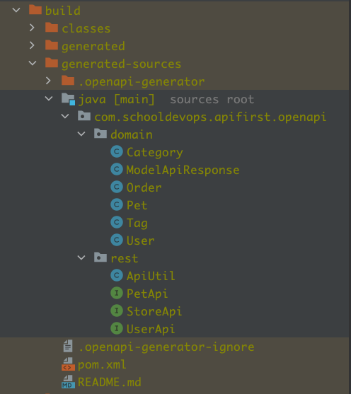
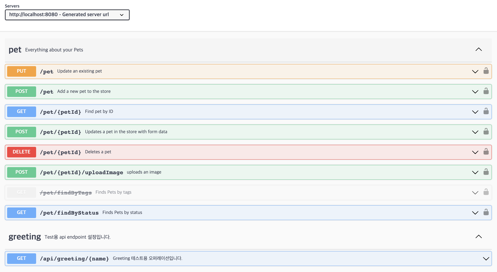
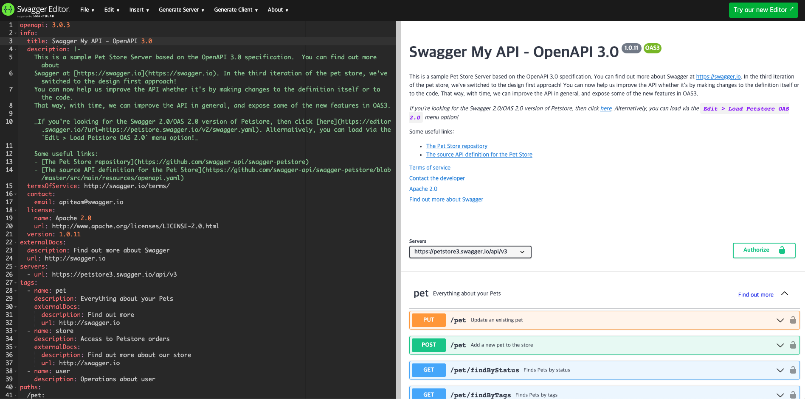

# Generating API with OpenAPI-Generator and Gradle

- 이번 아티클에서는 petstore.yaml 을 이용하여 openapi generator 를 통해 서버사이드 코드를 생성해 보겠다. 
- 이전 아티클에서는 maven 플러그인을 이용했지만 이번에는 gradle 플러그인을 이용하여 생성해 볼 것이다. 

## 프로젝트 생성하기 

- 우선 [start.spring.io](https://start.spring.io/) 에서 다음 설정으로 프로젝트를 생성하자. 
  - Project: Gradle-Groovy
  - Language: Java
  - SpringBoot: 2.7.13
  - Porject Metadata: 
    - Group: com.schooldevops.apifirst
    - Artifact: apifirstsamples
  - 의존성:
    - spring web
    - lombok

## 의존성 추가하기

- build.gradle 파일을 열고 다음과 같이 추가하자. 

### 플러그인 설치 

```go
plugins {
	id 'java'
//	boot version 2.7.x버젼
	id 'org.springframework.boot' version '2.7.13'
	id 'io.spring.dependency-management' version '1.0.15.RELEASE'

//	boot version 3.0.6 이후
//	id 'org.springframework.boot' version '3.0.6'
//	id 'io.spring.dependency-management' version '1.1.0'
	id "org.openapi.generator" version "6.5.0"
	id "com.diffplug.eclipse.apt" version "3.26.0"
}
```

- org.openapi.generator 버젼을 6.5.0으로 설정한다. openpai generator의 플러그인이다. 
- com.diffplug.eclipse.apt 버젼을 3.26.0 으로 설정한다. 이는 eclipse에서 필요한경우 사용할 수 있다. 

- 위 코드는 스프링부트 2.7.x 버젼과 3.0.6 버젼용으로 되어 있으니 버젼에 따라 지정하면 된다. 


### 의존성 설정하기 

- 이제 필요한 의존성을 설정하자. 아래와 같이 구역을 구분하여 설정하였다. 

```groovy
dependencies {
//	1. 기본 의존성 정보
	implementation 'org.springframework.boot:spring-boot-starter-web'
	compileOnly 'org.projectlombok:lombok'
	annotationProcessor 'org.projectlombok:lombok'
	testImplementation 'org.springframework.boot:spring-boot-starter-test'

//	2. springdoc-openapi 적용 정보 (Swagger 적용을 위한 정보)
	//	boot version 2.7.5 버젼
	implementation group: 'io.springfox', name: 'springfox-boot-starter', version: '3.0.0'
	implementation group: 'io.springfox', name: 'springfox-swagger-ui', version: '3.0.0'
	implementation 'io.swagger.core.v3:swagger-annotations-jakarta:2.2.11'
	//	boot version 3.0.6 버젼
//	implementation 'org.springdoc:springdoc-openapi-starter-webmvc-ui:2.1.0'

//	3. openapi generator 적용을 위한 정보
	//	boot version 2.7.5 버젼
	implementation 'org.openapitools:openapi-generator:5.1.1'
	implementation "org.openapitools:openapi-generator-gradle-plugin:5.1.1"
	//	boot version 3.0.6 버젼
//	implementation 'org.openapitools:openapi-generator:6.5.0'
//	implementation "org.openapitools:openapi-generator-gradle-plugin:6.5.0"

	implementation 'org.openapitools:jackson-databind-nullable:0.2.6'
	implementation 'javax.validation:validation-api:2.0.1.Final'
	implementation 'javax.annotation:javax.annotation-api:1.3.2'
	implementation 'javax.servlet:javax.servlet-api:4.0.1'
	implementation 'org.springframework.boot:spring-boot-starter-validation'
	implementation 'org.apache.httpcomponents.client5:httpclient5:5.2.1'

}
```

- 1. 기본설정
  - 이 영역에는 스프링부트를 위한 기본 설정이 지정되었다. 
- 2. springdoc-openapi 적용 정보 설정
  - Swagger 적용을 위한 위치이다. 부트 2.7.X 버젼에서는 이 설정이 필요하다. 
  - springfox-boot-starter: 스프링부트용 swagger 기본 패키지
  - springfox-swagger-ui: swagger ui를 노출하기 위한 버젼 
  - io.swagger.core.v3:swagger-annotations-jakarta: swagger 어노테이션을 위한 설정
  - 참고: 3.0.x 의 스프링부트의 경우 주석을 교체해주자. 
    - springdoc-openapi-starter-webmvc-ui: 2.1.0 만으로 이전 버젼의 다양한 설정을 대체할 수 있다. 
- 3. openapi generator 설정정보
  - openapi-generator:5.1.1 openapi generator 를 위해 필요한 패키지
  - openapi-generator-gradle-plugin:5.1.1 이는 openapi generator를 위한 gradle 플러그인이다 .
  - 참고: 3.0.x 의 스프링부트의 경우 주석을 교체해주자. 
<br/>
  - jackson-databind-nullable:0.2.6 REST API용으로 application/json을 변환하기 위한 패키지
  - validation-api:2.0.1.Final 스키마(데이터객체) 검증을위한 패키지 
  - javax.annotation-api:1.3.2 openapi에서 사용하는 어노테이션 처리용 패키지
  - javax.servlet-api:4.0.1 웹 엔드포인트를 생성하기 위한 서블릿 패키지
  - spring-boot-starter-validation 스프링부트 데이터 검증을위한 패키지
  - httpclient5:5.2.1 http 요청을 위한 클라이언트 패키지

<br/>

- 위와 같이 의존성 파일을 설정해 주어야 정상적으로 openapi generator로 스켈레톤 코드를 생성해 낼 수 있다. 

### openApiGenerate 코드 생성 Task 작성하기

- 이제 openApiGenerate를 위한 gradle 태스크를 생성하자. 
- openapi plugin은 openApiGenerate를 참조하게 된다. 

```groovy
openApiGenerate {
	verbose.set(true)
	generatorName.set("spring")
	library.set("spring-boot")
	inputSpec.set(project.file("$rootDir/src/main/resources/petstore.yaml").absolutePath)
//	outputDir.set(project.file("$rootDir/src/main/").absolutePath)
    outputDir.set(project.file("$buildDir/generated-sources").absolutePath)
	apiPackage.set("com.schooldevops.apifirst.openapi.rest")
	modelPackage.set("com.schooldevops.apifirst.openapi.domain")
	configOptions.set(
			[
					interfaceOnly: "true",
					useBeanValidation: "true",
					performBeanValidation: "true",
					serializableModel: "true",
					sourceFolder: "/java",
					implFolder: "/java",
			]
	)
}
```

- verbose.set(true)
  - true로 설정한 경우 생성되는 로그를 확인할 수 있다. 
- generatorName.set("spring")
  - 스프링 전용 코드를 생성하라는 의미이다. 이는 generator 가 어떠한 코드가 생성할지를 지정하는 값이다. 
- library.set("spring-boot")
  - 스프링 generator내부에 spring-boot 라이브러리를 이용하여 생성하라고 지정한다. 
- inputSpec
  - 생성할 openapi manifest 파일의 경로를 지정한다. 
  - 이는 웹으로도 지정할 수 있고, 로컬 파일로 지정할 수도 있다. 
- outputDir
  - 생성되는 파일이 위치하는 경로를 지정한다. 우리 파일은 프로젝트 디렉토리 내에 /generated-source 디렉토리에 생성한다는 의미이다. 
- apiPackage
  - 생성되는 REST API의 패키지 경로를 지정한다. 
- modelPackage
  - 생성되는 모델 REST API로 들어오는 데이터 객체 , 출력 객체가 생성될 위치를 지정한다. 
- configOptions
  - 설정 옵션을 지정하며, 생성되는 코드를 미세조정한다. 

<br/>

- 결국 위 코드는 소스 디렉토리의 petstore.yaml 파일을 읽어, openapi generator 를 통해서 서버 Skeleton 파일을 자동으로 생성하는 역할을 한다. 

### 프로젝트 빌드 설정

- 이제 소스가 자동으로 생성되었으므로, 생성된 소스를 컴파일 하도록 설정해야한다. 

```groovy
sourceSets {
    main {
        java {
            srcDirs = ['src/main/java', 'build/generated-sources/java']
        }
    }
}
```

- sourceSets
  - 우리가 컴파일해야할 대상 소스가 어디에 위치되어있는지 알려주는 역할을 한다. 
- srcDirs:
  - 대상 소스 디렉토리 목록을 지정한다. 
  - src/main/java
    - 원래 스프링부트 소스가 위치하는 디렉토리이다. 이 설정은 기본적으로 build.gradle에 있던 내용이다. 
  - build/generated-sources/java
    - openapi generator가 생성한 소스파일의 위치이다. 
## 샘플 코드 다운받기 

- 이제 샘플 코드를 다운받을 차례이다. 
- petstore.yaml 파일을 다운받아 /resources 폴더에 복사하자. 
  - 3.0 버젼: [petstore.yaml](./src/main/resources/petstore.yaml)

<br/>

- petstore.yaml 코드 내용을 간단히 살펴보자.

```yaml
openapi: 3.0.0
servers:
  - url: 'http://petstore.swagger.io/v2'
info:
  description: >-
    This is a sample server Petstore server. For this sample, you can use the api key
    `special-key` to test the authorization filters.
  version: 1.0.0
  title: OpenAPI Petstore
  license:
    name: Apache-2.0
    url: 'https://www.apache.org/licenses/LICENSE-2.0.html'
tags:
  - name: pet

#  ... 생략 

paths:
  /pet:
    post:
      tags:
        - pet
      summary: Add a new pet to the store
      description: ''
      operationId: addPet
      responses:
        '200':
          description: successful operation
          content:
            application/xml:
              schema:
                $ref: '#/components/schemas/Pet'
            application/json:
              schema:
                $ref: '#/components/schemas/Pet'
        '405':
          description: Invalid input
      security:
        - petstore_auth:
            - 'write:pets'
            - 'read:pets'
      requestBody:
        $ref: '#/components/requestBodies/Pet'
    put:
      tags:
        - pet
          
# ... 생략 


  schemas:
    Order:
      title: Pet Order
      description: An order for a pets from the pet store
      type: object
      properties:
        id:
          type: integer
          format: int64
        petId:
          type: integer
          format: int64
        quantity:
          type: integer
          format: int32
        shipDate:
          type: string
          format: date-time
        status:
          type: string
          description: Order Status
          enum:
            - placed
            - approved
            - delivered
        complete:
          type: boolean
          default: false
      xml:
        name: Order
        
# ... 생략

```


## 코드 생성하기 

- gradle을 이용하여 코드를 생성할 것이다. 

```shell
gradle clean openApiGenerate build
```

- 위 명령은 clean으로 기존 생성된 코드를 제거한다. 
- 그리고 openApiGenerate를 이용하여 좀전에 설정한 태스크를 실행한다. 
- build 는 소스파일을 빌드하도록 한다. 

- 위 명령을 실행하면 다음과 같이 build 디렉토리가 생성된다. 




<br/>

- PetApi.java

```java
package com.schooldevops.apifirst.apifirstsamples.controller;

// ...생략 

import javax.annotation.Generated;

@Generated(value = "org.openapitools.codegen.languages.SpringCodegen", date = "2023-05-15T16:32:18.367315+09:00[Asia/Seoul]")
@Validated
@Tag(name = "pet", description = "Everything about your Pets")
public interface PetApi {

  default Optional<NativeWebRequest> getRequest() {
    return Optional.empty();
  }

  /**
   * POST /pet : Add a new pet to the store
   *
   *
   * @param pet Pet object that needs to be added to the store (required)
   * @return successful operation (status code 200)
   *         or Invalid input (status code 405)
   */
  @Operation(
          operationId = "addPet",
          summary = "Add a new pet to the store",
          description = "",
          tags = { "pet" },
          responses = {
                  @ApiResponse(responseCode = "200", description = "successful operation", content = {
                          @Content(mediaType = "application/xml", schema = @Schema(implementation = Pet.class)),
                          @Content(mediaType = "application/json", schema = @Schema(implementation = Pet.class))
                  }),
                  @ApiResponse(responseCode = "405", description = "Invalid input")
          },
          security = {
                  @SecurityRequirement(name = "petstore_auth", scopes={ "write:pets", "read:pets" })
          }
  )
  @RequestMapping(
          method = RequestMethod.POST,
          value = "/pet",
          produces = { "application/xml", "application/json" },
          consumes = { "application/json", "application/xml" }
  )
  default ResponseEntity<Pet> addPet(
          @Parameter(name = "Pet", description = "Pet object that needs to be added to the store", required = true) @Valid @RequestBody Pet pet
  ) {
    getRequest().ifPresent(request -> {
      for (MediaType mediaType: MediaType.parseMediaTypes(request.getHeader("Accept"))) {
        if (mediaType.isCompatibleWith(MediaType.valueOf("application/json"))) {
          String exampleString = "{ \"photoUrls\" : [ \"photoUrls\", \"photoUrls\" ], \"name\" : \"doggie\", \"id\" : 0, \"category\" : { \"name\" : \"name\", \"id\" : 6 }, \"tags\" : [ { \"name\" : \"name\", \"id\" : 1 }, { \"name\" : \"name\", \"id\" : 1 } ], \"status\" : \"available\" }";
          ApiUtil.setExampleResponse(request, "application/json", exampleString);
          break;
        }
        if (mediaType.isCompatibleWith(MediaType.valueOf("application/xml"))) {
          String exampleString = "<Pet> <id>123456789</id> <Category> <id>123456789</id> <name>aeiou</name> </Category> <name>doggie</name> <photoUrls> <photoUrls>aeiou</photoUrls> </photoUrls> <tags> <Tag> <id>123456789</id> <name>aeiou</name> </Tag> </tags> <status>aeiou</status> </Pet>";
          ApiUtil.setExampleResponse(request, "application/xml", exampleString);
          break;
        }
      }
    });
    return new ResponseEntity<>(HttpStatus.NOT_IMPLEMENTED);

  }
  
//  ... 생략 

```

- 위와 같이 엔드포인트를 위한 default interface method 가 생성된다. 
- 이를 오버라이드 하면 우리가 원하는 비즈니스를 적용할 수 있다. 

## 생성된 코드 사용하기

- 이제 자동으로 api와 domain 객체가 생성되었으니 이를 사용해보자. 
- com.schooldevops.apifirst.apifirstsamples.controller 하위에 PetControllerImpl.java 파일을 생성하고 다음과 같이 작성하자. 

```java
package com.schooldevops.apifirst.apifirstsamples.controller;

import com.schooldevops.apifirst.apifirstsamples.domain.Pet;
import org.springframework.http.ResponseEntity;
import org.springframework.web.bind.annotation.RestController;

@RestController
public class PetControllerImpl implements PetApi {
  @Override
  public ResponseEntity<Pet> getPetById(Long petId) {
    // TODO.. 생성된 pet Rest api 에 해당하는 비즈니스 로직을 작성하자. 
    return PetApi.super.getPetById(petId);
  }
}

```

- 위와 같이 getPetById() 메소드를 Override 해보자.
- 즉, openapi-generator를 통해서 생성된 코드는 인터페이스이며, 이 코드를 구현하여 비즈니스 로직을 생성하게 되는 구조이다. 

## 실행하기 

- 이제 다시 어플리케이션을 실행하고, swagger-ui 를 확인해보자. 




- 보는바와 같이 swagger-ui 에 REST API 엔드포인트가 생성된 것을 확인할 수 있다. 

## 참고

- openapi-generator를 위한 manifest editor 를 사용해서 생성해보자. 
- [editor.swagger.io](https://editor.swagger.io/) 에서 샘플을 보고, 샘플을 수정해보자. 좌측은 샘플, 우측은 swagger-ui 결과를 확인할 수 있다. 
- [editor-next.swagger.io](https://editor-next.swagger.io/) 는 좀더 향상된 에디터이다. 둘중 어느곳에서든지 생성은 가능하며, 취향에 따라 선택하자.  




from: https://editor.swagger.io/


## WrapUp

- 지금까지 openapi-generator 와 gradle 설정에 대해서 알아 보았다. 
- petstore.yaml 파일은 openapi-generator를 통해 생성할 manifest 파일이며, 이 파일의 정의에 따라 자동으로 REST API가 생성이 된다. 
- 이렇게 생성한 코드는 인터페이스이며, 인터페이스를 구현하면 마지막에 본 내용과 같이 swagger-ui에서 생성된 REST API 목록을 확인할 수 있다. 
- 이로써 자동을 생성된 코드를 사용할 수 있을 뿐만 아니라, 다양한 코드로도 생성할 수 있어, 마이크로 서비스 인터페이스를 작성할때 표준화된 코드로, 쉽게 코드를 생성할 수 있다. 
